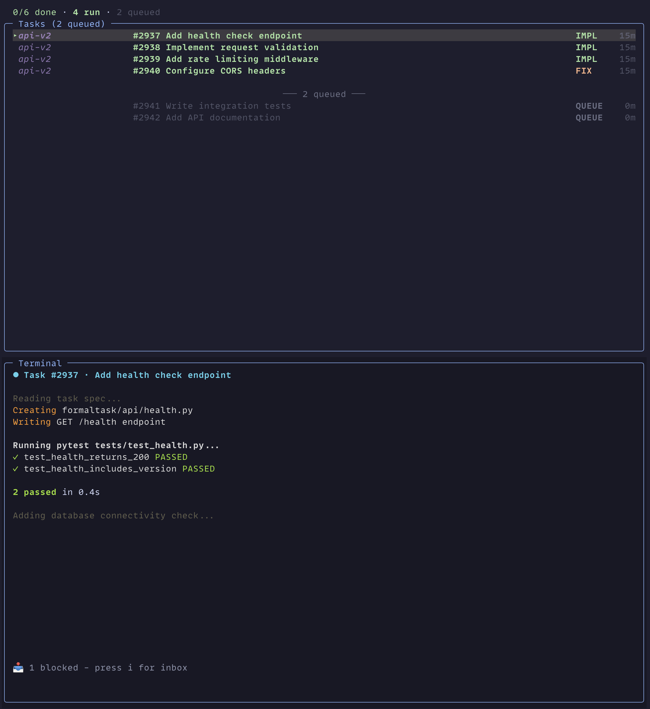

# FormalTask

Note: If you have any issues, please let me know! Will try to fix.

Open source declarative orchestration for parallel Claude Code agents — define quality gates in YAML, enforce them automatically.

## What This Gets You

- **Parallel workers in isolated git worktrees** — scale to 10 agents working simultaneously
- **Auto-spawn fixer tasks when CI fails** — workers fix their own broken builds
- **Nudge stuck workers after 1 hour** — no silent failures
- **Workers spawn new tasks mid-flight** — agents create agents when they find problems
- **Block completion until reviews pass** — quality gates enforced, not suggested



## Quick Start

```bash
pip install formaltask
ft setup        # Initialize database + register hooks
```

That's it. `ft setup` creates `.claude/formaltask.db` and configures Claude Code hooks.

## Prerequisites

- **Python 3.11+** (required)
- **Git** (for hooks and version control)
- **tmux 3.2+** (optional, enables parallel worker features)

## Walkthrough

### 1. Create an epic

An epic is a container for related tasks:

```bash
ft epic create auth-system "User authentication system"
```

### 2. Add tasks

```bash
ft task add auth-system "Add login endpoint" \
    "JWT-based POST /auth/login endpoint" \
    --criteria "Returns 200 with valid credentials" \
    --criteria "Returns 401 with invalid credentials"

ft task add auth-system "Add logout endpoint" \
    "Clear JWT cookie on POST /auth/logout" \
    --criteria "Returns 200 and clears auth cookie"
```

Check your tasks:

```bash
ft task list auth-system
```

### 3. Spawn a worker

A worker is a Claude Code session running in an isolated git worktree:

```bash
ft work spawn 1    # Spawn worker for task #1
```

This creates a worktree branch, starts a tmux session, and injects the task assignment into the Claude Code session.

### 4. Monitor and complete

```bash
ft work list               # Quick status check
ft work inbox              # See workers waiting for human input
ft work dashboard          # Interactive TUI dashboard
```

Workers call `ft task complete <id>` themselves when done. The completion system checks quality gates (reviews, acceptance criteria) before marking it complete.

### 5. Spawn all ready tasks at once

```bash
ft work spawn --epic auth-system
```

FormalTask respects dependency chains — it only spawns tasks whose dependencies are complete.

## How It Works

```
Plan → Critique → Specs → Tasks → Workers → Complete → Merge
```

**Plan**: `/plan` explores the codebase and writes a structured plan with goals, requirements, and risks.

**Critique + Revise**: `/critique` identifies gaps and issues. `/revise` addresses findings. The plan carries its full revision history — each critique round appends to `history`, and revisions mark findings as `fixed|rejected|deferred`.

**Specs + Tasks**: `/decompose` splits the plan into YAML specs with dependency tracking, acceptance criteria, and required reviews. `ft epic decompose` commits tasks to SQLite with:
- **Executable acceptance criteria** — commands that run at completion time
- **Input/output wiring** — cross-task data handoff with auto-inferred dependencies
- **Full spec as worker context** — the complete YAML spec stored for the worker to reference

See [Planning Workflow](skills/PLANNING-WORKFLOW.md) for the full lifecycle.

**Workers**: `ft work spawn` launches parallel Claude workers in isolated git worktrees. Each worker gets its task assignment, quality gates, and review requirements injected automatically.

**Complete + Merge**: Workers call `ft task complete` when done. The completion system evaluates: Did required reviews pass? Are acceptance criteria with `command:` fields passing? Guards enforce the spec as a contract.

## CLI Reference

```bash
# Setup
ft setup                                      # Setup wizard (also: ft init)
ft doctor                                     # Verify configuration

# Task management
ft task add <epic> "Title" "Desc" --criteria "..."  # Add task to epic
ft task list <epic>                           # List tasks in an epic
ft task show <id>                             # Show task details
ft task update <id> --title/--add-criteria/--depends-on  # Update task fields
ft task complete <id>                         # Complete task (runs quality gates)
ft task complete <id> --no-evidence           # Skip evidence guard (audit/doc tasks)
ft task cancel <id> --reason "..."            # Cancel task (reason required)
ft task defer <id> --reason "..."             # Defer task
ft task create-from-finding FILE LINE --title "..."  # New task from review finding

# Epic management
ft epic create <name> "Description"           # Create epic (description required)
ft epic list                                  # List all epics
ft epic close <name>                          # Archive epic
ft epic close <name> --force                  # Archive with incomplete tasks
ft epic decompose <name> <spec-dir>           # Create tasks from spec YAMLs
ft epic decompose <name> <spec-dir> --force   # Re-decompose (deletes existing tasks)
ft epic decompose <name> <spec-dir> --validate  # Validate only, don't create tasks
ft epic update <name> --feature-branch <branch>  # Set feature branch
ft epic review <name>                         # Check merge readiness
ft epic health <name>                         # Check dependency health

# Reviews
ft review store '<json>'                      # Store review packet
ft review disposition FILE LINE --reason "R"  # Disposition a finding

# Git integration
ft commit-scan --task-id <id>                 # Scan commits for task evidence
ft commit-link <task-id> <hash>               # Manually link commit to task

# Worker management
ft work spawn <id>                            # Spawn single worker
ft work spawn --epic <name>                   # Spawn all ready tasks
ft work list                                  # List spawnable tasks
ft work watch --spawn                         # Monitor + auto-spawn
ft work dashboard                             # TUI dashboard
ft work inbox                                 # Show blocked workers
ft work resume <id> [--epic <name>] [-m "msg"]  # Resume existing session
ft work restart [--dry-run] [--resume]        # Restart orphaned workers

# Templates
ft formula list/cook/batch                    # Template management
```

See the [CLI Reference](docs/cli/index.md) for full documentation, [Planning Workflow](skills/PLANNING-WORKFLOW.md) for the plan→critique→revise→decompose lifecycle, and [Architecture Overview](docs/architecture/overview.md) for how the pieces fit together.

## Dashboard

The interactive TUI dashboard (`ft work dashboard`) provides real-time monitoring and control of parallel workers.

**Layout:** Status bar (top) showing task counts and auto-spawn state, task list (middle) with color-coded health indicators, terminal pane (bottom) showing the selected worker's output.

**Worker states:** Each task shows a health indicator — **LIVE** (running), **EXIT** (process ended), **HELP** (needs human input), **FIX** (has review findings), or **queued** (ready to spawn).

**Keybindings:**

| Key | Action |
|-----|--------|
| `j` / `k` | Navigate task list |
| `Enter` | Attach to selected worker (F12 to detach back) |
| `S` | Spawn next queued task |
| `A` | Toggle auto-spawn (automatically fills worker slots) |
| `+` / `-` | Adjust max worker limit (1-10) |
| `X` | Kill selected worker (double-tap to confirm) |
| `R` | Restart selected worker (double-tap to confirm) |
| `i` | Open inbox (blocked workers awaiting input) |
| `q` | Quit |

**Auto-spawn** fills available worker slots from the task queue. The status bar shows the current limit (e.g. `auto (5)`). Adjust with `+`/`-` to scale up or down without leaving the dashboard.

---

## Architecture

### Specs Are Contracts, Guards Enforce Them

Specs declare what the completion system will check:

```yaml
title: "Task 2: Implement API client"
depends_on: [1]
required_reviews: ["code-quality", "security"]
inputs:
  schema: "$task[1].outputs.schema"       # Auto-wired from Task 1
outputs:
  client: ".artifacts/api_client.py"      # Task 3 can reference this
acceptance_criteria:
  - id: "c-1"
    current: "GET /users returns parsed User objects"
    command: "pytest tests/test_api.py"   # Runnable verification
```

When `ft task complete` runs, the completion check evaluates: Did `required_reviews` all pass? Are acceptance criteria with `command:` fields passing? The spec is the contract. Guards enforce it.

### The Rules Kernel

One abstraction runs everything:

```python
@dataclass
class Rule:
    when: str      # condition DSL
    then: str      # output (phase name or Jinja2 template)
    target: str    # what it applies to ("task.phase", "notify", "tool.block")
    priority: int  # 0 = informational, 1 = blocks, 999 = catchall
    name: str      # reason (literal or state key for dynamic lookup)
```

Five fields. That's it. The same structure decides:
- **Is this task done?** → completion checks
- **Should we spawn a CI fixer?** → orchestration
- **What prompt should this worker get?** → prompt generation
- **Should we block this tool call?** → safety guards

First match wins. Override anything by adding a higher-priority rule — per task, per epic, or globally. No subclassing, no config files, no special cases. Just rules.

The condition DSL: `AND`, `OR`, `NOT`, comparisons, dotted paths (`task.metadata.retries`). Flatten complex logic into multiple rules instead of nesting.

Three rule sets ship by default:

| Rule set | Purpose |
|----------|---------|
| `BUILTIN_RULES` | 22 completion rules (review gates, PR checks, docs, acceptance criteria) |
| `ORCHESTRATION_RULES` | Watch daemon triggers (e.g., alert after 1 hour) |
| `TOOL_REDIRECT_RULES` | Block/redirect tool usage |

#### Custom Rules Per Task

Tasks can define their own rules in `metadata.completion_rules`. These are prepended before `BUILTIN_RULES`, so they get first-match-wins priority:

```python
# In a spec or task metadata:
"completion_rules": [
    {
        "when": "blocking_findings AND review_rounds.self-critique >= 2",
        "then": "needs_escalation",
        "target": "task.phase",
        "priority": 1,
        "name": "Round cap hit. Escalate to human."
    }
]
```

This lets individual tasks define their own completion policies without modifying global rules.

#### User Templates

Worker prompt templates use the same kernel. Drop a Jinja2 file in `~/.claude/templates/` to override any bundled template — user templates take priority, with automatic fallback to bundled on parse errors.

### Plans Carry Their Revision History

Critiques don't live in separate files — they're embedded in the plan:

```yaml
goals:
  - id: "g-1"
    current: "Users can log in with email/password"
    history:
      - version: "r1"
        text: "Users can log in"
        critique:
          verdict: "FIX_AND_SHIP"
          findings:
            - priority: "P1"
              finding: "Missing rate limiting"
              action: "Add rate limiter"
              resolution: "fixed"  # Set by /revise
```

Each `/critique` round appends to `history`. When `/revise` addresses findings, it sets `resolution: fixed|rejected|deferred`. The plan carries its full revision history.

### Workers Create Their Own Tasks

A worker that finds a problem during review can create a new task on the spot:

```bash
ft task create-from-finding src/auth.py 42 --title "Fix session expiry edge case"
```

This creates a **critique-gated** task — a task with self-critique baked in:

1. The task starts in a **critique phase** (`c1`). The worker must self-review before moving to execution.
2. A custom completion rule caps critique rounds: if P0/P1 findings persist after 2 self-critique rounds, the task escalates to a human via `ft work blocked`.
3. Only after receiving a `verdict_go` does the task transition to the **exec phase** where normal completion rules apply.

The task inherits its epic from the spawning worker, carries provenance (`source_task_id`, `finding_ref`), and can be auto-spawned by the watch daemon.

### Feature Branches

By default, each worker branches from `origin/master`. For larger epics where multiple workers should share a common integration branch, set a feature branch on the epic:

```bash
ft epic update my-epic --feature-branch my-epic-branch
```

Once set, all workers spawned for that epic will:
- **Branch from** the feature branch instead of master
- **Create PRs targeting** the feature branch (enforced by a PreToolUse guard that blocks `gh pr create` with the wrong `--base`)
- **Be blocked from pushing** directly to master (enforced by a pre-push hook)

This keeps parallel workers isolated from master until the epic is ready to merge. When all tasks are complete, merge the feature branch to master as a single integration point.

---

## Optional: LLM Features

Some features use an LLM via OpenRouter for review self-critique and vault summarization. These are not required for core task management.

```bash
export OPENROUTER_API_KEY="<your-key>"
```

Core operations (`ft epic create`, `ft task add`, `ft work spawn`, `ft task complete`, `ft work dashboard`) work without it.

### Optional Feature Groups

Install additional features using pip extras:

| Extra | Purpose |
|-------|---------|
| `llm` | LLM client libraries (openai, instructor) |
| `tui` | Terminal user interface dashboard |
| `test` | Testing dependencies (pytest, hypothesis) |
| `dev` | Development tools (ruff, basedpyright) |
| `agents` | Agent-related utilities |
| `mcp` | MCP server integration |
| `all` | All optional dependencies |

## Configuration

### Environment Variables

| Variable | Required | Purpose |
|----------|----------|---------|
| `OPENROUTER_API_KEY` | No | LLM-powered review self-critique and vault summarization. Not required for core task management |
| `PROJECT_ROOT` | For tests | Database path resolution |

### Database

Task data is stored in `.claude/formaltask.db` (SQLite).

## Development Installation

```bash
git clone https://github.com/davidabeyer/formaltask.git
cd formaltask
python3 -m venv venv && source venv/bin/activate
./install.sh
```

Or manually:

```bash
pip install -e ".[all]"
git config core.hooksPath .githooks
```

## Development

```bash
pytest tests/ --cov=formaltask    # Tests
ruff check formaltask/ --fix      # Lint
basedpyright formaltask/          # Type check
```

## Project Structure

```text
formaltask/
├── cli/                # CLI commands (ft <noun> <verb>)
├── core/               # Completion checking, config
├── db/                 # Database connection, migrations
├── epics/              # Epic CRUD, YAML parsing
├── git/                # Worktree management, PR queries
├── tasks/              # Task lifecycle, dependencies, guards
├── validators/         # PreToolUse validators (doc-guard, sql-guard)
├── workers/            # Worker spawning, monitoring
├── apps/               # TUI applications (dashboard)
└── utils/              # Shared utilities
agents/                 # Subagent definitions
hooks/                  # Hook entry points for Claude Code events
tests/                  # Test suite
.githooks/              # Tracked git hooks
```

## License

MIT License. See [LICENSE](LICENSE) for details.
