# Diagram Templates

Mermaid diagram patterns for comprehensive implementation evaluation.

## Component Dependency Graph

Shows relationships between components. Highlights coupling and orphans.

### Basic Pattern
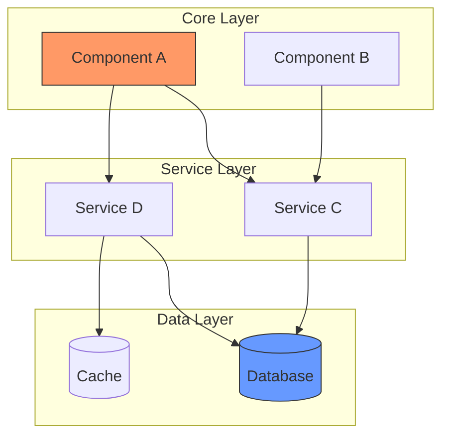
```mermaid
graph TD
    subgraph "Core Layer"
        A[Component A]
        B[Component B]
    end

    subgraph "Service Layer"
        C[Service C]
        D[Service D]
    end

    subgraph "Data Layer"
        E[(Database)]
        F[(Cache)]
    end

    A --> C
    A --> D
    B --> C
    C --> E
    D --> E
    D --> F

    style A fill:#f96,stroke:#333
    style E fill:#69f,stroke:#333
```

### With Coupling Indicators
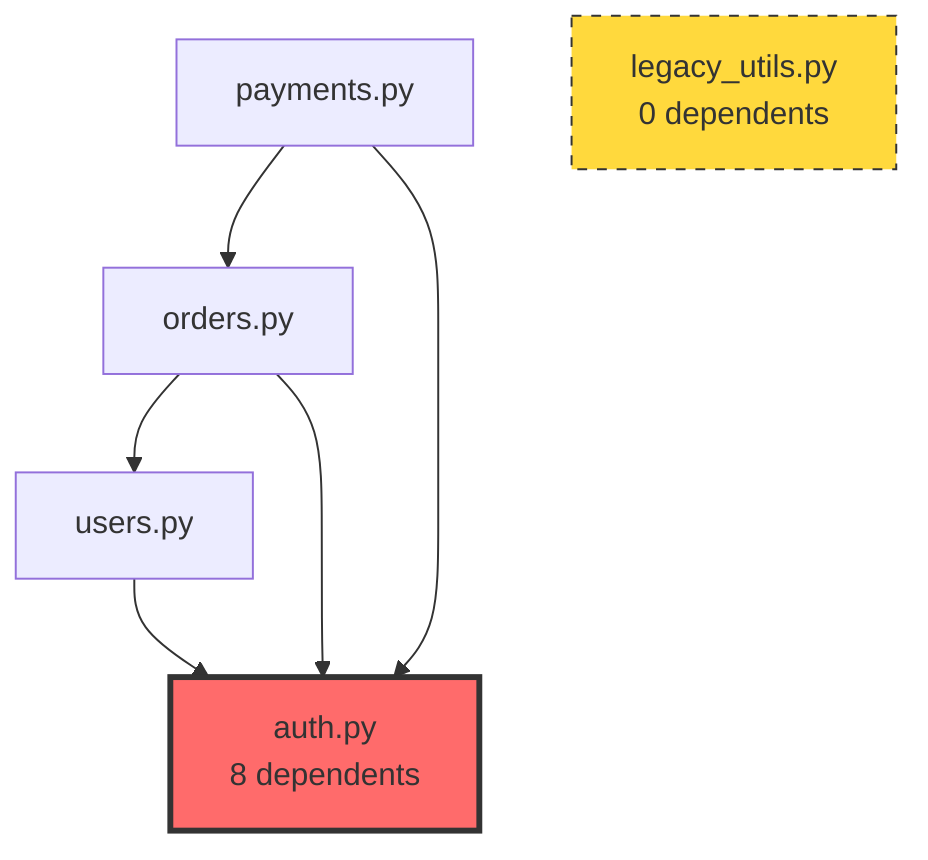
```mermaid
graph TD
    %% High coupling (many dependents) - highlighted
    A[auth.py<br/>8 dependents]:::hotspot

    %% Normal coupling
    B[users.py]
    C[orders.py]
    D[payments.py]

    %% Low/no coupling (orphan) - highlighted
    E[legacy_utils.py<br/>0 dependents]:::orphan

    B --> A
    C --> A
    C --> B
    D --> A
    D --> C

    classDef hotspot fill:#ff6b6b,stroke:#333,stroke-width:3px
    classDef orphan fill:#ffd93d,stroke:#333,stroke-dasharray: 5 5
```

### With External Dependencies
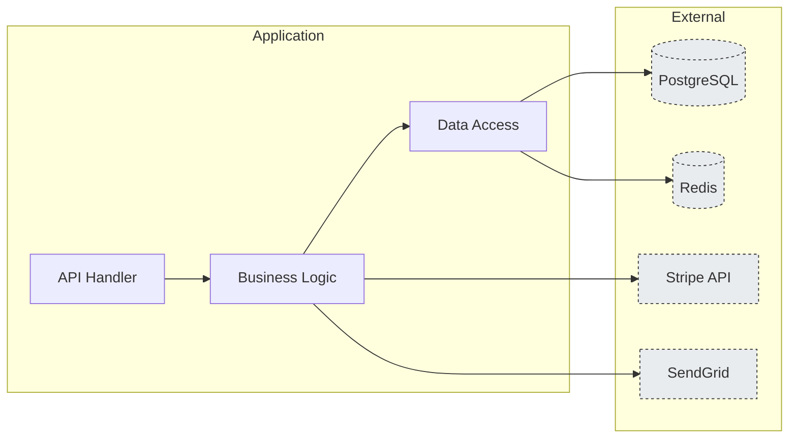
```mermaid
graph LR
    subgraph "Application"
        A[API Handler]
        B[Business Logic]
        C[Data Access]
    end

    subgraph "External"
        D[(PostgreSQL)]:::external
        E[(Redis)]:::external
        F[Stripe API]:::external
        G[SendGrid]:::external
    end

    A --> B
    B --> C
    B --> F
    B --> G
    C --> D
    C --> E

    classDef external fill:#e9ecef,stroke:#333,stroke-dasharray: 3 3
```

## Control Flow Diagrams

Shows execution paths through code including branches and loops.

### Basic Happy Path
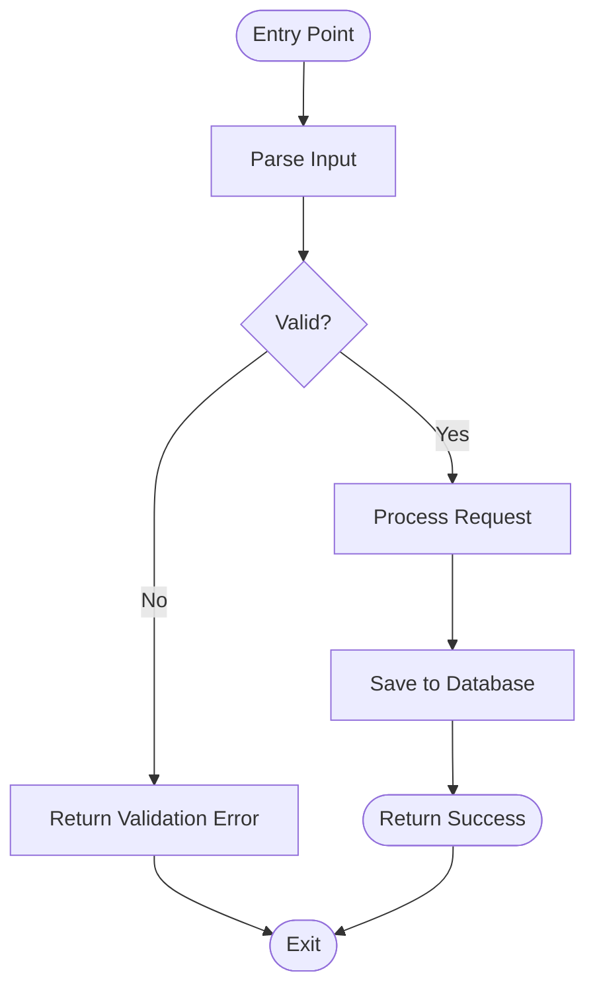
```mermaid
flowchart TD
    Start([Entry Point]) --> Parse[Parse Input]
    Parse --> Validate{Valid?}
    Validate -->|Yes| Process[Process Request]
    Validate -->|No| Error1[Return Validation Error]
    Process --> Save[Save to Database]
    Save --> Success([Return Success])
    Error1 --> End([Exit])
    Success --> End
```

### With Error Handling
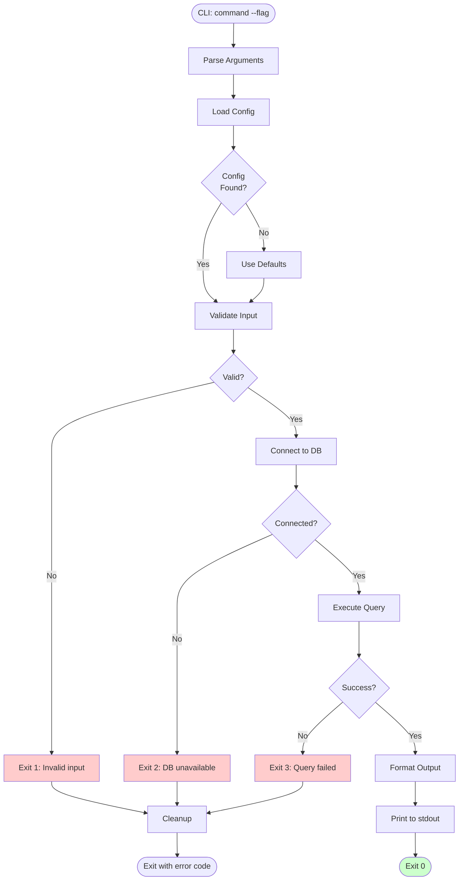
```mermaid
flowchart TD
    Start([CLI: command --flag]) --> Parse[Parse Arguments]
    Parse --> LoadConfig[Load Config]
    LoadConfig --> ConfigCheck{Config<br/>Found?}

    ConfigCheck -->|Yes| Validate[Validate Input]
    ConfigCheck -->|No| UseDefaults[Use Defaults]
    UseDefaults --> Validate

    Validate --> ValidCheck{Valid?}
    ValidCheck -->|No| ValidationErr[Exit 1: Invalid input]
    ValidCheck -->|Yes| Connect[Connect to DB]

    Connect --> ConnCheck{Connected?}
    ConnCheck -->|No| ConnErr[Exit 2: DB unavailable]
    ConnCheck -->|Yes| Query[Execute Query]

    Query --> QueryCheck{Success?}
    QueryCheck -->|No| QueryErr[Exit 3: Query failed]
    QueryCheck -->|Yes| Format[Format Output]

    Format --> Output[Print to stdout]
    Output --> Success([Exit 0])

    ValidationErr --> Cleanup[Cleanup]
    ConnErr --> Cleanup
    QueryErr --> Cleanup
    Cleanup --> Fail([Exit with error code])

    style ValidationErr fill:#ffcccc
    style ConnErr fill:#ffcccc
    style QueryErr fill:#ffcccc
    style Success fill:#ccffcc
```

### With Retry Logic
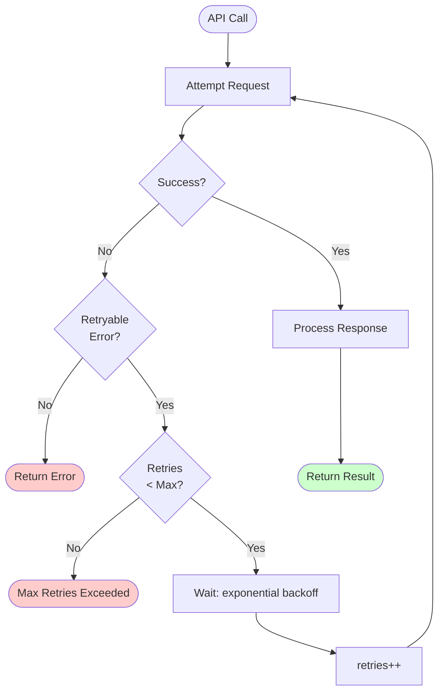
```mermaid
flowchart TD
    Start([API Call]) --> Attempt[Attempt Request]
    Attempt --> Check{Success?}

    Check -->|Yes| Process[Process Response]
    Check -->|No| Retryable{Retryable<br/>Error?}

    Retryable -->|No| Fail([Return Error])
    Retryable -->|Yes| RetryCount{Retries<br/>< Max?}

    RetryCount -->|No| Exhaust([Max Retries Exceeded])
    RetryCount -->|Yes| Backoff[Wait: exponential backoff]

    Backoff --> Increment[retries++]
    Increment --> Attempt

    Process --> Success([Return Result])

    style Fail fill:#ffcccc
    style Exhaust fill:#ffcccc
    style Success fill:#ccffcc
```

## State Transition Diagrams

Shows all states an entity can be in and valid transitions.

### Basic State Machine
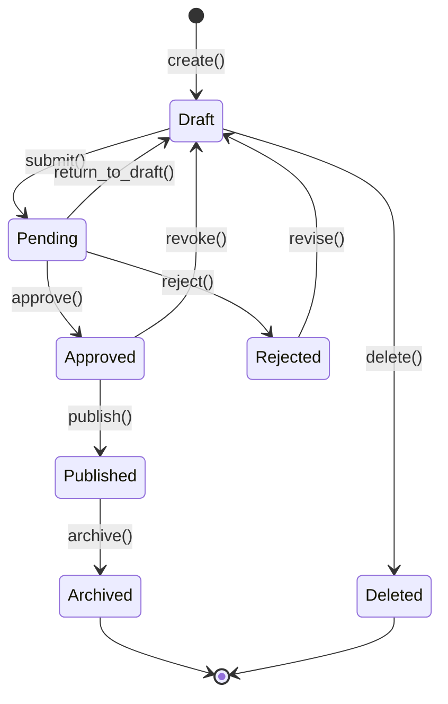
```mermaid
stateDiagram-v2
    [*] --> Draft: create()
    Draft --> Pending: submit()
    Draft --> Deleted: delete()
    Pending --> Approved: approve()
    Pending --> Rejected: reject()
    Pending --> Draft: return_to_draft()
    Approved --> Published: publish()
    Approved --> Draft: revoke()
    Rejected --> Draft: revise()
    Published --> Archived: archive()
    Archived --> [*]
    Deleted --> [*]
```

### With Guards and Actions
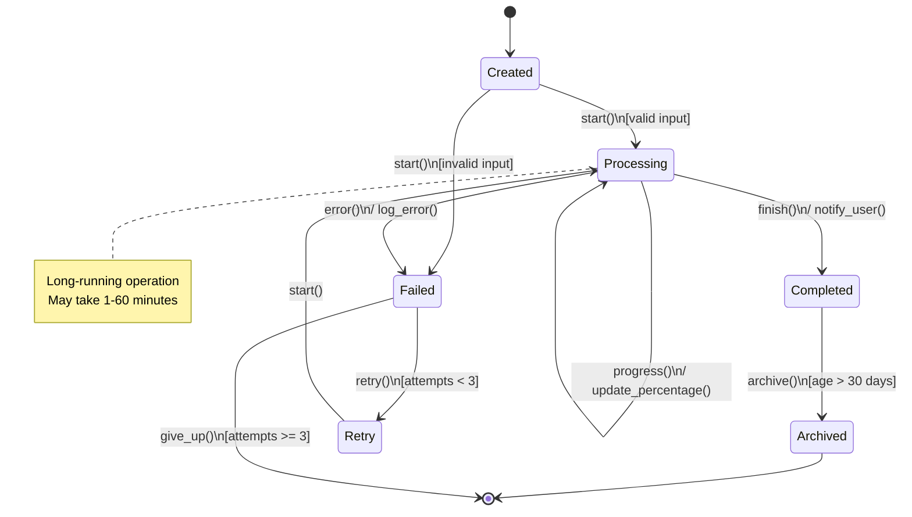
```mermaid
stateDiagram-v2
    [*] --> Created

    Created --> Processing: start()\n[valid input]
    Created --> Failed: start()\n[invalid input]

    Processing --> Completed: finish()\n/ notify_user()
    Processing --> Failed: error()\n/ log_error()
    Processing --> Processing: progress()\n/ update_percentage()

    Completed --> Archived: archive()\n[age > 30 days]
    Failed --> Retry: retry()\n[attempts < 3]
    Retry --> Processing: start()

    Archived --> [*]
    Failed --> [*]: give_up()\n[attempts >= 3]

    note right of Processing
        Long-running operation
        May take 1-60 minutes
    end note
```

### Task Lifecycle Example
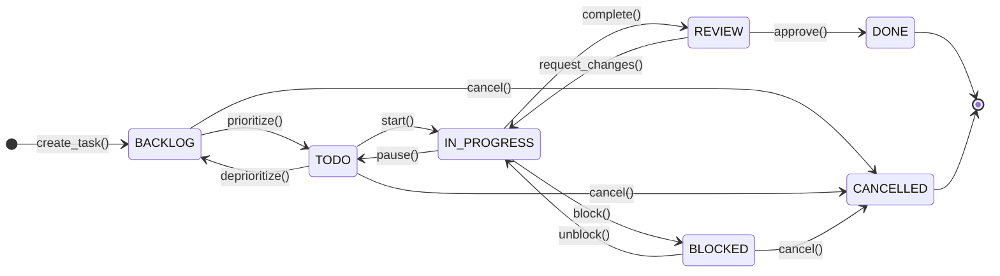
```mermaid
stateDiagram-v2
    direction LR

    [*] --> BACKLOG: create_task()

    BACKLOG --> TODO: prioritize()
    BACKLOG --> CANCELLED: cancel()

    TODO --> IN_PROGRESS: start()
    TODO --> BACKLOG: deprioritize()
    TODO --> CANCELLED: cancel()

    IN_PROGRESS --> BLOCKED: block()
    IN_PROGRESS --> REVIEW: complete()
    IN_PROGRESS --> TODO: pause()

    BLOCKED --> IN_PROGRESS: unblock()
    BLOCKED --> CANCELLED: cancel()

    REVIEW --> IN_PROGRESS: request_changes()
    REVIEW --> DONE: approve()

    DONE --> [*]
    CANCELLED --> [*]
```

## Data Flow Diagrams

Shows how data moves through the system.

### Basic Data Flow
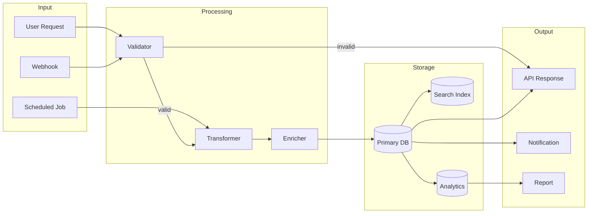
```mermaid
flowchart LR
    subgraph Input
        A[User Request]
        B[Webhook]
        C[Scheduled Job]
    end

    subgraph Processing
        D[Validator]
        E[Transformer]
        F[Enricher]
    end

    subgraph Storage
        G[(Primary DB)]
        H[(Search Index)]
        I[(Analytics)]
    end

    subgraph Output
        J[API Response]
        K[Notification]
        L[Report]
    end

    A --> D
    B --> D
    C --> E

    D -->|valid| E
    D -->|invalid| J

    E --> F
    F --> G
    G --> H
    G --> I

    G --> J
    G --> K
    I --> L
```

### With Transformations
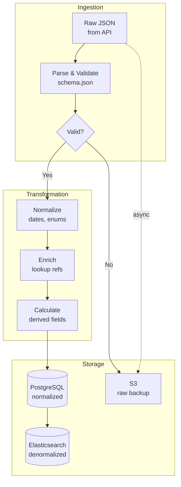
```mermaid
flowchart TD
    subgraph "Ingestion"
        A[Raw JSON<br/>from API] --> B[Parse & Validate<br/>schema.json]
        B --> C{Valid?}
    end

    subgraph "Transformation"
        D[Normalize<br/>dates, enums]
        E[Enrich<br/>lookup refs]
        F[Calculate<br/>derived fields]
    end

    subgraph "Storage"
        G[(PostgreSQL<br/>normalized)]
        H[(Elasticsearch<br/>denormalized)]
        I[S3<br/>raw backup]
    end

    C -->|Yes| D
    C -->|No| I

    D --> E
    E --> F
    F --> G
    G --> H

    A -.->|async| I
```

## Sequence Diagrams

Shows interactions between components over time.

### API Request Flow
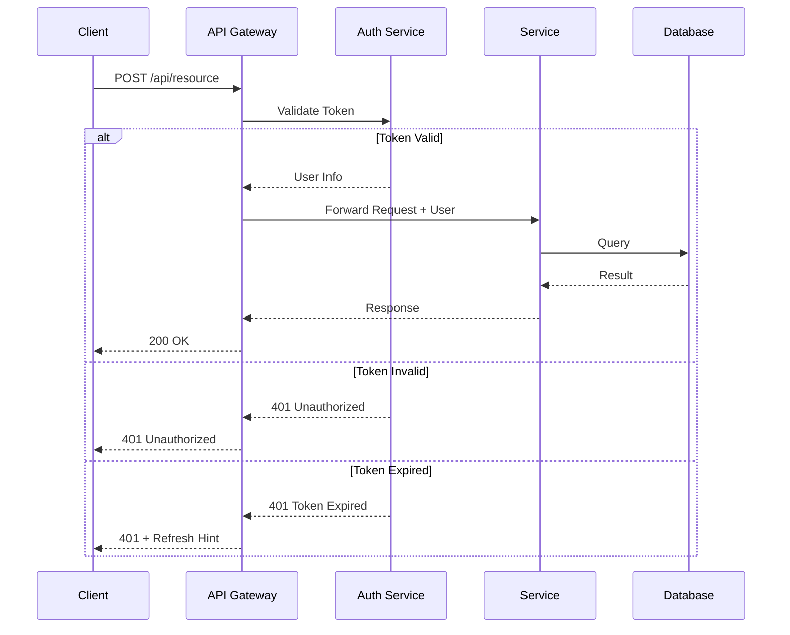
```mermaid
sequenceDiagram
    participant C as Client
    participant G as API Gateway
    participant A as Auth Service
    participant S as Service
    participant D as Database

    C->>G: POST /api/resource
    G->>A: Validate Token

    alt Token Valid
        A-->>G: User Info
        G->>S: Forward Request + User
        S->>D: Query
        D-->>S: Result
        S-->>G: Response
        G-->>C: 200 OK
    else Token Invalid
        A-->>G: 401 Unauthorized
        G-->>C: 401 Unauthorized
    else Token Expired
        A-->>G: 401 Token Expired
        G-->>C: 401 + Refresh Hint
    end
```

### With Async Processing
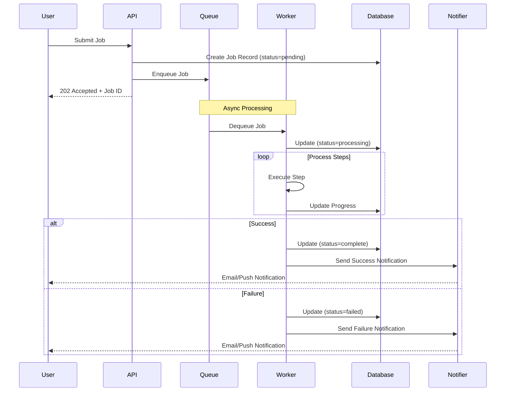
```mermaid
sequenceDiagram
    participant U as User
    participant A as API
    participant Q as Queue
    participant W as Worker
    participant D as Database
    participant N as Notifier

    U->>A: Submit Job
    A->>D: Create Job Record (status=pending)
    A->>Q: Enqueue Job
    A-->>U: 202 Accepted + Job ID

    Note over Q,W: Async Processing

    Q->>W: Dequeue Job
    W->>D: Update (status=processing)

    loop Process Steps
        W->>W: Execute Step
        W->>D: Update Progress
    end

    alt Success
        W->>D: Update (status=complete)
        W->>N: Send Success Notification
        N-->>U: Email/Push Notification
    else Failure
        W->>D: Update (status=failed)
        W->>N: Send Failure Notification
        N-->>U: Email/Push Notification
    end
```

### Error Recovery Flow
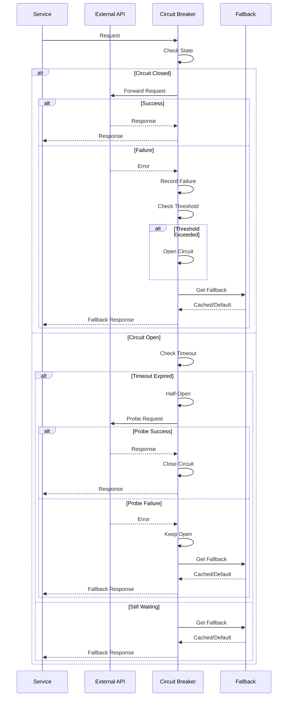
```mermaid
sequenceDiagram
    participant S as Service
    participant E as External API
    participant C as Circuit Breaker
    participant F as Fallback

    S->>C: Request
    C->>C: Check State

    alt Circuit Closed
        C->>E: Forward Request
        alt Success
            E-->>C: Response
            C-->>S: Response
        else Failure
            E-->>C: Error
            C->>C: Record Failure
            C->>C: Check Threshold
            alt Threshold Exceeded
                C->>C: Open Circuit
            end
            C->>F: Get Fallback
            F-->>C: Cached/Default
            C-->>S: Fallback Response
        end
    else Circuit Open
        C->>C: Check Timeout
        alt Timeout Expired
            C->>C: Half-Open
            C->>E: Probe Request
            alt Probe Success
                E-->>C: Response
                C->>C: Close Circuit
                C-->>S: Response
            else Probe Failure
                E-->>C: Error
                C->>C: Keep Open
                C->>F: Get Fallback
                F-->>C: Cached/Default
                C-->>S: Fallback Response
            end
        else Still Waiting
            C->>F: Get Fallback
            F-->>C: Cached/Default
            C-->>S: Fallback Response
        end
    end
```

## Entity Relationship Diagrams

Shows data model structure.

### Basic ERD
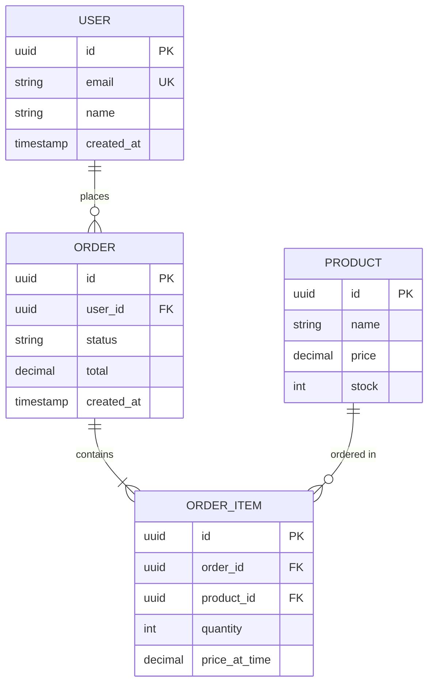
```mermaid
erDiagram
    USER ||--o{ ORDER : places
    USER {
        uuid id PK
        string email UK
        string name
        timestamp created_at
    }

    ORDER ||--|{ ORDER_ITEM : contains
    ORDER {
        uuid id PK
        uuid user_id FK
        string status
        decimal total
        timestamp created_at
    }

    PRODUCT ||--o{ ORDER_ITEM : "ordered in"
    PRODUCT {
        uuid id PK
        string name
        decimal price
        int stock
    }

    ORDER_ITEM {
        uuid id PK
        uuid order_id FK
        uuid product_id FK
        int quantity
        decimal price_at_time
    }
```

## Class Diagrams

Shows class structure and relationships.

### Service Layer Pattern
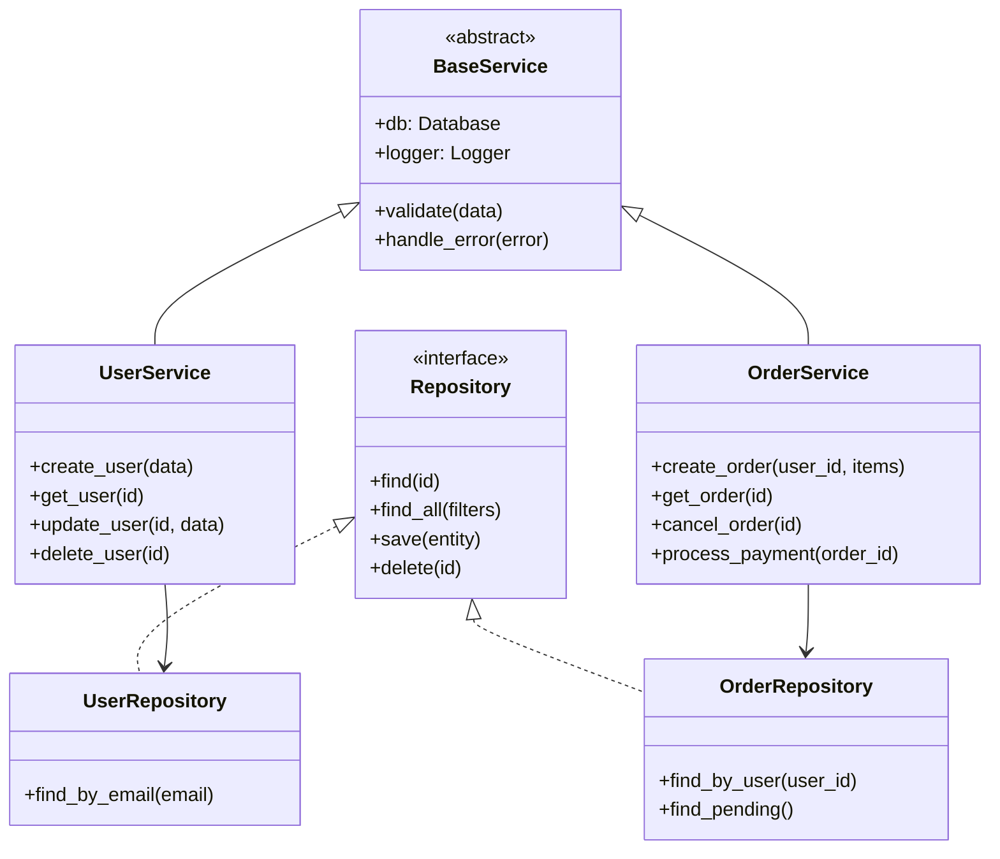
```mermaid
classDiagram
    class BaseService {
        <<abstract>>
        +db: Database
        +logger: Logger
        +validate(data)
        +handle_error(error)
    }

    class UserService {
        +create_user(data)
        +get_user(id)
        +update_user(id, data)
        +delete_user(id)
    }

    class OrderService {
        +create_order(user_id, items)
        +get_order(id)
        +cancel_order(id)
        +process_payment(order_id)
    }

    class Repository {
        <<interface>>
        +find(id)
        +find_all(filters)
        +save(entity)
        +delete(id)
    }

    class UserRepository {
        +find_by_email(email)
    }

    class OrderRepository {
        +find_by_user(user_id)
        +find_pending()
    }

    BaseService <|-- UserService
    BaseService <|-- OrderService
    Repository <|.. UserRepository
    Repository <|.. OrderRepository
    UserService --> UserRepository
    OrderService --> OrderRepository
```

## Styling Reference

### Node Colors
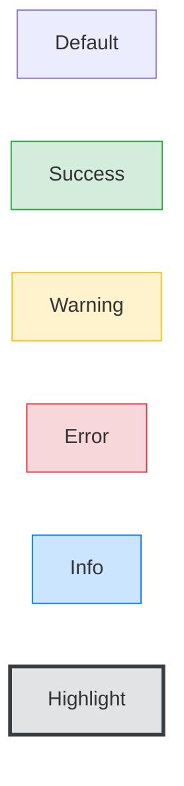
```mermaid
flowchart LR
    A[Default]
    B[Success]:::success
    C[Warning]:::warning
    D[Error]:::error
    E[Info]:::info
    F[Highlight]:::highlight

    classDef success fill:#d4edda,stroke:#28a745
    classDef warning fill:#fff3cd,stroke:#ffc107
    classDef error fill:#f8d7da,stroke:#dc3545
    classDef info fill:#cce5ff,stroke:#007bff
    classDef highlight fill:#e2e3e5,stroke:#383d41,stroke-width:3px
```

### Edge Styles
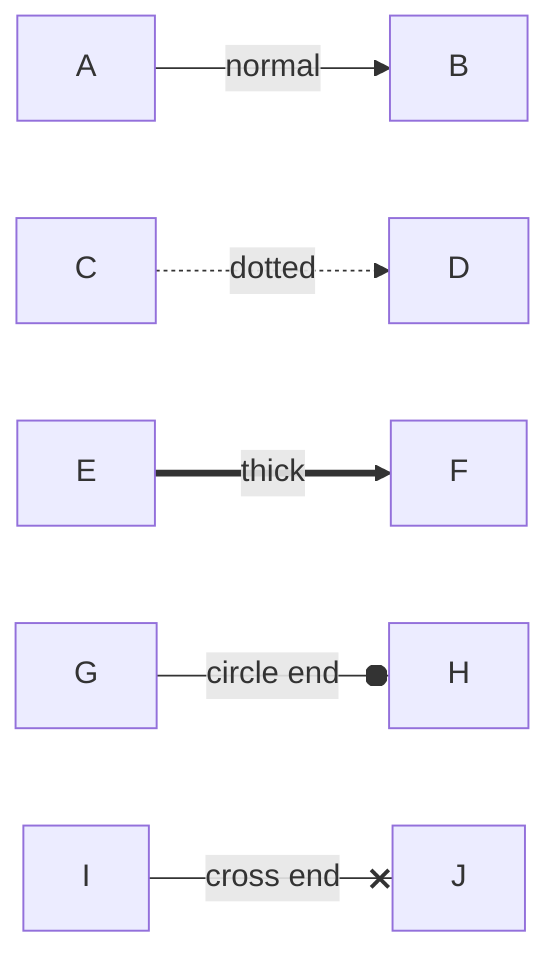
```mermaid
flowchart LR
    A -->|normal| B
    C -.->|dotted| D
    E ==>|thick| F
    G --o|circle end| H
    I --x|cross end| J
```

### Subgraph Styling
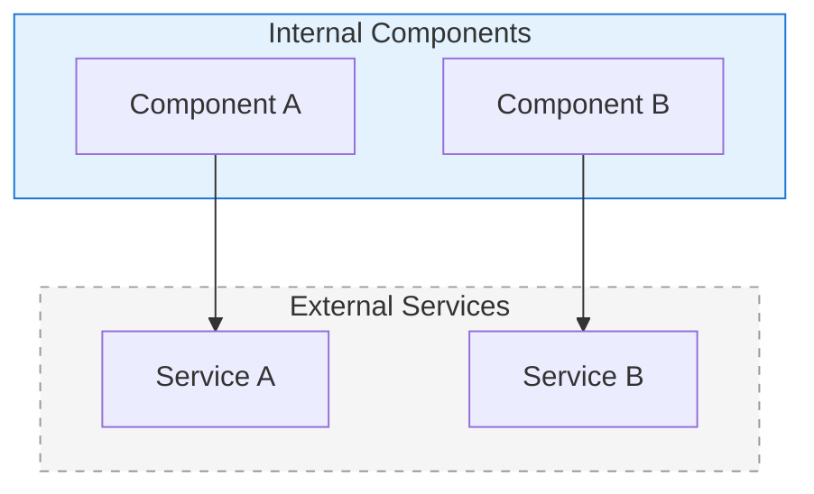
```mermaid
flowchart TD
    subgraph external["External Services"]
        style external fill:#f5f5f5,stroke:#999,stroke-dasharray: 5 5
        E1[Service A]
        E2[Service B]
    end

    subgraph internal["Internal Components"]
        style internal fill:#e3f2fd,stroke:#1976d2
        I1[Component A]
        I2[Component B]
    end

    I1 --> E1
    I2 --> E2
```

## Best Practices

1. **Limit complexity** - Break large diagrams into focused sub-diagrams
2. **Use consistent styling** - Same colors for same concepts across diagrams
3. **Label edges** - Always explain what the connection means
4. **Direction matters** - LR for flows, TD for hierarchies
5. **Subgraphs for grouping** - Use to show logical boundaries
6. **Highlight concerns** - Use color to draw attention to issues
