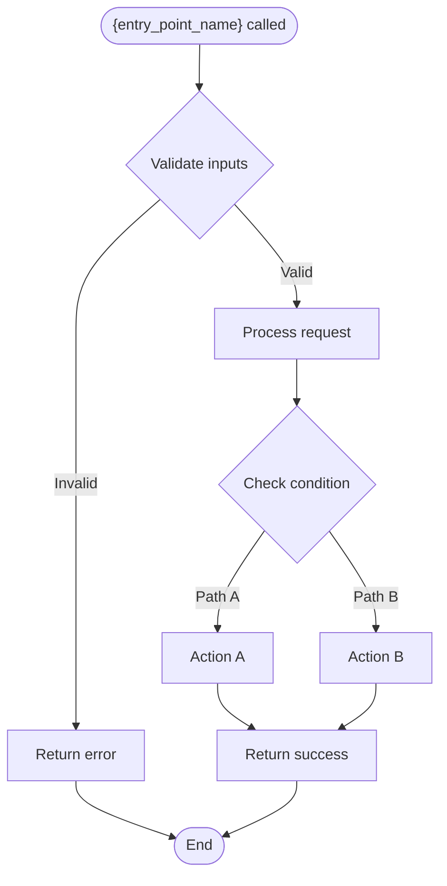

# Handoff Template: Entry Point Analysis

**Purpose**: Template for delegating entry point analysis to parallel subagents. Each subagent traces one entry point's execution paths, state mutations, and generates a control flow diagram.

**Usage**: Main agent fills placeholders `{...}` with entry point-specific context.

---

# Handoff: Entry Point Analysis - {entry_point_name}

**Parent Skill:** implementation-evaluator
**Entry Point:** {entry_point_name}
**Entry Point Type:** {type: CLI | API | Hook | Scheduler | Consumer | Watcher | Function}
**Subagent Type:** general-purpose
**Output Location:** {output_path}

---

## Verification

**STOP AND VERIFY BEFORE PROCEEDING:**

You are the **Entry Point Analyzer** for `{entry_point_name}`.

- If this role does NOT match your spawn description, STOP and report mismatch.
- If the output location already exists with content, STOP and report conflict.

---

## Mission

You analyze a single entry point in an implementation by tracing all execution paths, tracking state mutations, and documenting findings. Your output includes a Mermaid control flow diagram.

**Success Looks Like:** A structured analysis with all paths enumerated, state mutations documented, and a Mermaid diagram visualizing the control flow.

---

## Entry Point Details

### Basic Information

| Field | Value |
|-------|-------|
| Name | `{entry_point_name}` |
| Type | {type} |
| File | `{file_path}` |
| Line | {start_line} |
| Signature | `{signature}` |

### Context

{Brief description of what this entry point does and its role in the implementation}

---

## Analysis Checklist

Execute ALL of the following for this entry point:

### Path Enumeration

- [ ] **Happy Paths** - Normal successful execution flows
  - Standard input -> expected output
  - All valid parameter combinations
  - Successful state transitions

- [ ] **Error Paths** - Handled failure modes
  - Validation failures and their handling
  - Business logic rejections
  - External dependency failures
  - Timeout scenarios

- [ ] **Edge Cases** - Boundary conditions
  - Empty inputs, null values
  - Maximum/minimum values
  - Unicode, special characters
  - Concurrent operations
  - First-time vs. repeat operations

- [ ] **Adversarial Scenarios** - Malformed/malicious inputs
  - Injection attempts (if applicable)
  - Type coercion attacks
  - Overflow/underflow attempts
  - Resource exhaustion

### State Tracking

- [ ] What variables change during execution?
- [ ] What database writes occur?
- [ ] What files are modified?
- [ ] What external calls are made?
- [ ] What resources are acquired/released?

### Decision Points

- [ ] Where does logic branch?
- [ ] What conditions control branching?
- [ ] Are all branches reachable?
- [ ] Are there dead code paths?

---

## Inputs Provided

### Files to Read

| Input | Path | What to Look For |
|-------|------|------------------|
| Entry Point File | `{file_path}` | Main implementation |
| {Supporting File 1} | `{supporting_path_1}` | Called functions |
| {Supporting File N} | `{supporting_path_n}` | Dependencies |

### Implementation Context

{Any additional context about the implementation, conventions, or patterns}

---

## Expected Output

### Output File

**YOU MUST WRITE TO:** `{output_path}`

### Required Format

```markdown
# Entry Point Analysis: {entry_point_name}

**Analyzed:** {timestamp}
**Entry Point:** `{entry_point_name}`
**Type:** {type}
**File:** `{file_path}:{start_line}`

## Summary

{2-3 sentence executive summary of this entry point's behavior}

## Control Flow Diagram



## Path Enumeration

### Happy Paths

#### Path H1: {Short Title}
- **Input:** {what triggers this path}
- **Flow:** {step by step execution}
- **Output:** {what is returned/produced}
- **State Changes:** {mutations}

### Error Paths

#### Path E1: {Short Title}
- **Trigger:** {what causes this error}
- **Handling:** {how it's handled}
- **Output:** {error response}
- **Cleanup:** {any rollback/cleanup}

### Edge Cases

#### Path X1: {Short Title}
- **Condition:** {edge condition}
- **Behavior:** {what happens}
- **Handling:** {HANDLED | PARTIAL | MISSING}
- **Risk Level:** {LOW | MEDIUM | HIGH}

### Adversarial Scenarios

#### Path A1: {Short Title}
- **Attack:** {attack type}
- **Handling:** {BLOCKED | PARTIAL | VULNERABLE}
- **Risk Level:** {LOW | MEDIUM | HIGH | CRITICAL}

## State Mutations

| Operation | Location | Data Affected | Reversible |
|-----------|----------|---------------|------------|
| {op} | {where} | {what} | {yes/no} |

## Decision Points

| Line | Condition | Branches | Notes |
|------|-----------|----------|-------|
| {line} | {condition} | {count} | {any concerns} |

## Observations

### Potential Issues
- {Issue 1 with file:line reference}
- {Issue 2 with file:line reference}

### Missing Handling
- {Missing case 1}
- {Missing case 2}

### Race Condition Windows
- {If any}

## Quality Checklist

- [ ] All happy paths traced
- [ ] All error paths traced
- [ ] Edge cases enumerated
- [ ] Adversarial scenarios considered
- [ ] State mutations documented
- [ ] Decision points mapped
- [ ] Mermaid diagram generated
- [ ] Output written to correct location
```

---

## Mermaid Diagram Requirements

Your control flow diagram MUST include:

1. **START node** - Entry point invocation
2. **Validation checks** - Input validation decisions
3. **Decision points** - All conditional branches
4. **Action nodes** - Key operations performed
5. **Error paths** - How errors are handled
6. **END node(s)** - Exit points (success/failure)

### Diagram Style

```mermaid
flowchart TD
    %% Use TD (top-down) for clarity
    %% START/END use ([ ]) for terminals
    %% Decisions use { }
    %% Actions use [ ]
    %% Paths labeled with |condition|
```

---

## Tools You Should Use

| Tool | Purpose | When to Use |
|------|---------|-------------|
| `Read` | Load files | Read entry point file and dependencies |
| `Write` | Save output | Write analysis to output location |
| `Grep` | Search patterns | Find function calls, error handling |
| `LSP:goToDefinition` | Navigate code | Follow function calls |
| `LSP:findReferences` | Find callers | Understand usage patterns |

---

## Anti-Patterns to Avoid

- **Skipping paths**: Enumerate ALL paths, not just obvious ones
- **Missing diagram**: MUST include Mermaid control flow diagram
- **Vague state tracking**: Be specific about what mutates
- **No file references**: Every finding needs `file:line` reference
- **Incomplete adversarial**: Consider security even for internal entry points

---

## Verification Steps

### Before Writing Output

1. [ ] All path categories analyzed (happy, error, edge, adversarial)
2. [ ] State mutations documented with locations
3. [ ] Decision points mapped with conditions
4. [ ] Mermaid diagram created and valid
5. [ ] All findings have file:line references

### After Writing Output

1. [ ] Output written to correct path
2. [ ] Output follows required format
3. [ ] Quality checklist completed
4. [ ] Mermaid diagram renders correctly

---

**End of Entry Point Handoff**
